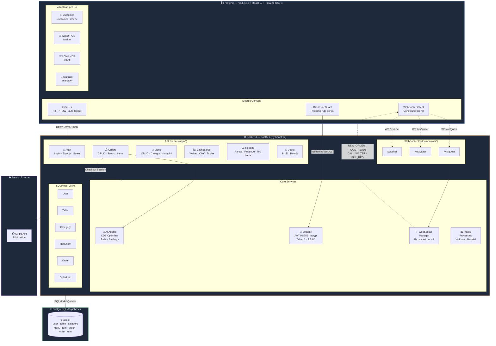
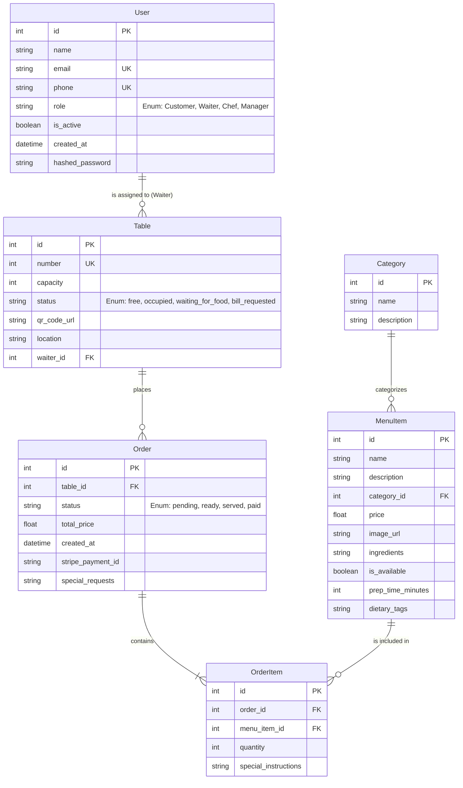
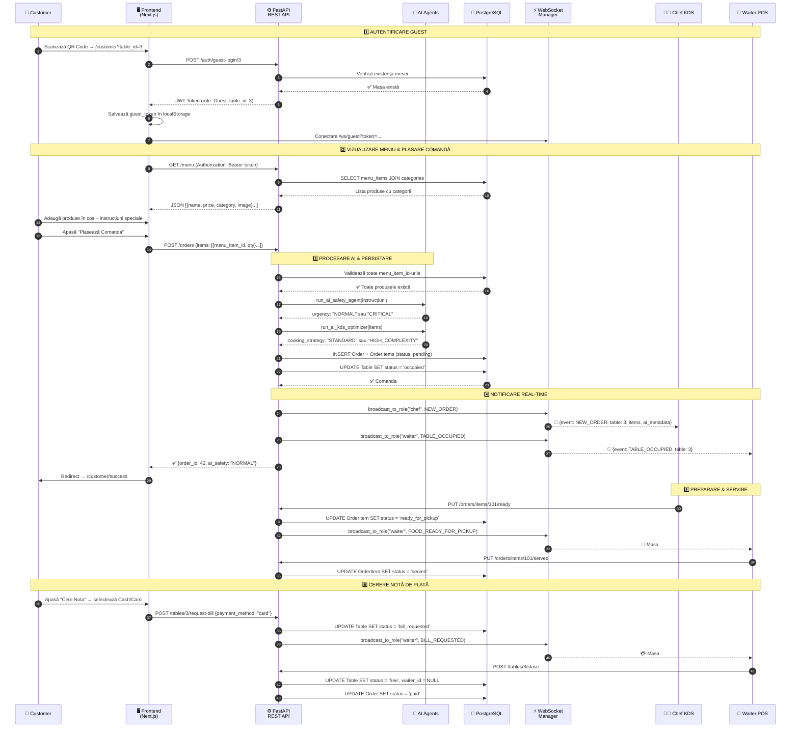
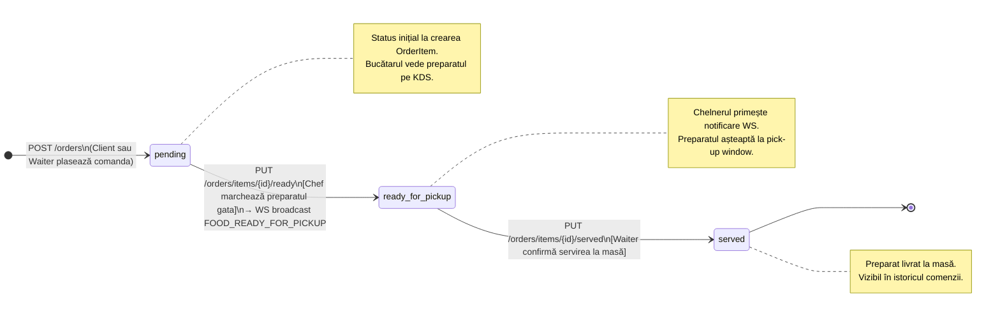
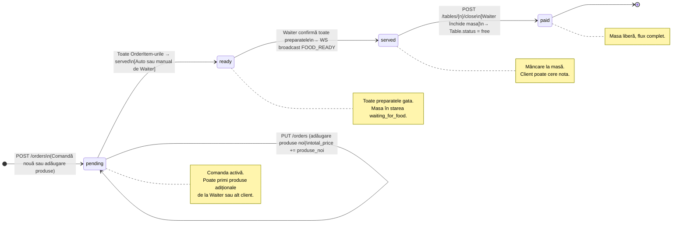

# RestroManager 🍽️
*We are "vibe coding" our way to a better dining experience.*

## 🎯 Product Vision
**RestroManager** is a full-stack university project designed to act as the ultimate digital manager for modern restaurants. Our primary goal is to **smooth out the customer experience** by removing traditional dining friction—from waiting for menus to trying to catch a waiter's attention. By connecting the Customer, Waiter, Chef, and Manager into one seamless, real-time digital flow, RestroManager ensures faster service, fewer errors, and a more enjoyable environment for everyone.

---

## 👤 User Stories

### 📱 For the Customer
* **US 1:** As a customer, I want to view the digital menu by categories (drinks, main courses, desserts) with pictures and ingredients, so that I know exactly what I'm ordering and can find items quickly.
* **US 2:** As a customer, I want to add special instructions to a dish (e.g., "no onion" or "well done"), so that my food respects my dietary preferences and allergies.
* **US 3:** As a customer, I want a "Call Waiter" button in the app, so that I can easily request assistance or order extras without having to wave across the room.
* **US 4:** As a customer, I want an AI-powered chat assistant that recommends dishes based on my preferences and dietary restrictions, so that I can discover new menu items I'll enjoy.

### 🏃 For the Waiter
* **US 5:** As a waiter, I want to see a color-coded floor map showing the real-time status of each table (free, occupied, waiting for food, bill requested), so that I know exactly where my attention is needed.
* **US 6:** As a waiter, I want to receive a push notification on my device when an order is ready in the kitchen, so that I can serve the food hot and fresh immediately.
* **US 7:** As a waiter, I want to receive a push notification on my device when one of my customers calls me, so I can be there for them ASAP and assist them.
* **US 8:** As a waiter, I want to manually input orders into the system for customers not using the app, so that all restaurant orders stay synced in one central digital flow.

### 👨‍🍳 For the Chef
* **US 9:** As a chef, I want to see a Kitchen Display System (KDS) with order tickets ordered chronologically, so that I know exactly what to prioritize and cook first.
* **US 10:** As a chef, I want to mark a dish/order as "Ready to serve" with a single tap, so that it automatically notifies the assigned waiter to pick it up.

### 👔 For the Manager
* **US 11:** As a manager, I want to easily add, edit, or remove menu items and prices, so that I can keep the restaurant's offering updated in real-time without reprinting physical menus.
* **US 12:** As a manager, I want to generate an end-of-day sales report, so that I can track total revenue and identify the best-selling menu items.
* **US 13:** As a manager, I want to add categories in my UI so that the products are filtered as I wish in the menu.

---

## 🛠️ Tech Stack
To ensure a highly responsive, real-time experience while maintaining a clean and scalable codebase, RestroManager is built using a modern decoupled architecture:

### Frontend
* **Framework:** Next.js 16+ (React 19+, TypeScript)

### Backend
* **Framework:** FastAPI (Python 3.12)
* **ORM:** SQLModel (SQLAlchemy + Pydantic)
* **Database:** PostgreSQL (psycopg2-binary)
* **Migrations:** Alembic
* **Authentication:** JWT (PyJWT) + bcrypt
* **Testing:** pytest with async support
* **Configuration:** pydantic-settings

### Real-time & Communication
* **WebSocket:** Native FastAPI WebSockets
* **HTTP Client:** httpx

### AI & External Services
* **AI Recommendation Agent:** DeepSeek V4 (via OpenAI-compatible API)
* **SDK:** openai (Python)
* **API Base:** https://api.deepseek.com

---

## 📐 Arhitectura Sistemului (Component Diagram)

RestroManager folosește o **arhitectură decuplată pe 3 straturi**: un frontend Next.js cu vizualizări per rol, un backend FastAPI modular (routere REST + WebSocket real-time), și o bază de date PostgreSQL accesată prin SQLModel ORM. Cererile standard (meniu, comenzi, rapoarte) folosesc **REST API**, iar evenimentele sensibile la timp (notificări bucătărie, apel chelner, status masă) trec prin **WebSocket** pentru actualizări instantanee. Securitatea este asigurată prin **JWT Role-Based Auth** (Guest, Waiter, Chef, Manager), iar doi **agenți AI** analizează fiecare comandă pentru prioritizare și detecție de alergeni. Un **agent AI de recomandare** (DeepSeek V4) oferă sugestii personalizate clienților printr-un chat interactiv.



**Cum funcționează fluxul:** Fiecare rol (Customer, Waiter, Chef, Manager) accesează o vizualizare dedicată în frontend-ul Next.js. Toate cererile HTTP trec prin modulul centralizat `lib/api.ts` care injectează automat token-ul JWT și gestionează expirarea sesiunii. Routerele FastAPI procesează logica de business, validează permisiunile prin middleware-ul RBAC, și accesează baza de date prin modelele SQLModel.

**Comunicarea real-time:** La plasarea unei comenzi, doi agenți AI (KDS Optimizer și Safety Agent) analizează comanda, apoi WebSocket Manager-ul broadcast-ează evenimentul `NEW_ORDER` către Chef KDS. Când bucătarul marchează un preparat ca „Gata", evenimentul `FOOD_READY_FOR_PICKUP` ajunge instant la chelnerul asignat. Clientul poate de asemenea trimite `CALL_WAITER` sau `BILL_REQUESTED` prin canalul WebSocket dedicat.

## 🗄️ Database Schema

The foundational data model ensures a normalized and robust representation of the restaurant's operational flow.



## � Fluxul unei Comenzi (Sequence Diagram)

Diagrama de mai jos ilustrează ciclul complet al unei comenzi — de la scanarea codului QR de către client, până la servirea mâncării și cererea notei de plată. Aceasta arată interacțiunea dintre toate cele 4 roluri și sistemele intermediare (API, AI, WebSocket, Baza de Date).



**Pașii 1–2 (Autentificare & Meniu):** Clientul scanează codul QR de pe masă, care deschide aplicația cu parametrul `table_id`. Frontend-ul obține automat un JWT token de tip Guest (fără cont/parolă), apoi afișează meniul grupat pe categorii. La plasarea comenzii, frontend-ul trimite `menu_item_id` (nu numele) pentru fiecare produs, iar backend-ul calculează totalul server-side din prețurile reale din DB.

**Pașii 3–4 (AI & Notificări):** Backend-ul rulează doi agenți AI pe fiecare comandă: Safety Agent detectează alergeni/urgențe din instrucțiunile speciale, iar KDS Optimizer evaluează complexitatea preparării. Comanda este apoi broadcast-ată în timp real prin WebSocket către Chef KDS (cu metadatele AI) și către Waiter POS (notificare de masă ocupată).

**Pașii 5–6 (Servire & Plată):** Bucătarul marchează fiecare preparat individual ca „Gata", iar chelnerul primește notificarea instant și confirmă servirea. La final, clientul poate cere nota direct din aplicație, iar chelnerul închide masa — resetând statusul la „free" pentru următorii clienți.

---

## � Ciclul de Viață al Comenzii (State Diagram)

Diagramele de mai jos ilustrează toate stările posibile pentru entitățile centrale ale sistemului: `OrderItem` (un preparat individual) și `Order` (întreaga comandă a mesei). Tranzițiile sunt declanșate fie de acțiunile utilizatorilor (Chef, Waiter), fie automat de backend la evenimentele de sistem.

### OrderItem — Stările unui Preparat Individual



### Order — Stările Comenzii de Masă



**`OrderItem`** urmează un flux liniar strict: `pending → ready_for_pickup → served`. Fiecare tranziție este declanșată de un rol specific — bucătarul marchează `ready_for_pickup` (cu notificare WS instantanee), iar chelnerul confirmă `served` după livrare. Stările sunt independente per preparat, permițând servirea parțială a comenzii.

**`Order`** are un ciclu de viață mai complex: rămâne în `pending` atât timp cât bucătăria lucrează, poate primi produse adiționale în această stare (de la Waiter sau un al doilea client la aceeași masă), și trece prin `ready → served → paid` odată ce toată masa a fost servită și nota achitată.

---

## �🚀 Quick Start (Local Development)

To make it as easy as possible to grade or review the system, the backend is fully containerized.

### Prerequisites
- **Docker & Docker Compose** (Colima, Docker Desktop, etc.)
- **Python 3.12+** (For the local virtual environment)
- A **PostgreSQL** database (We use a cloud Supabase instance, but any standard PostgreSQL works)

### 1. Configure the Environment

1. Clone the repository.
2. Create a `.env` file in the root directory containing your DB URL:
```env
DATABASE_URL="postgresql://[USER]:[PASSWORD]@[HOST]:5432/postgres"
```

### 2. Run the API (Backend with Docker)

We use Docker for a seamless hot-reloading experience. From the root directory:
```bash
docker compose up --build
```
> The Interactive API Documentation (Swagger) will instantly be available at `http://localhost:8000/docs`.

### 3. Seed the Database

To populate the fresh database with a Manager, 5 Tables, Categories, and 10 Menu Items, open a new terminal:
```bash


# 1. Create & activate a virtual environment

python3 -m venv .venv
source .venv/bin/activate

# 2. Install backend utilities

pip install -r backend/requirements.txt

# 3. Populate database
python backend/seed.py
```

## 🤖 AI Recommendation Agent

RestroManager includes an AI-powered chat assistant to help customers discover dishes they'll love.

### Configuration

Add your DeepSeek API key to `.env`:

```env
DEEPSEEK_API_KEY=your_deepseek_api_key_here
```

Get your API key at: https://platform.deepseek.com/

### Features

| Feature | Description |
|---------|-------------|
| 💬 Chat Interface | Natural conversation to understand customer preferences |
| 🍽️ Smart Recommendations | Suggests 2-3 dishes based on taste, allergies, dietary restrictions |
| 🛡️ Safety Guard | Only answers food/menu questions; redirects off-topic queries |
| 📝 Special Notes | Dialog for adding instructions when adding AI-recommended items |
| 🔄 Fallback | Keyword matching when AI service is unavailable |

### Available Models

- `deepseek-v4-flash` (default) - Fast responses, cost-effective
- `deepseek-v4-pro` - Higher quality, better JSON formatting

---

## 🧪 AI Agent Evaluation Framework

RestroManager includes a comprehensive evaluation framework for testing the DeepSeek recommendation agent across multiple dimensions: recommendation quality, safety guardrails, and conversational coherence.

### What's Included

| Component | Description | Test Count |
|-----------|-------------|------------|
| **Recommendation Quality** | Precision@K, NDCG, diversity metrics | 15+ tests |
| **Safety Guardrails** | Off-topic rejection, false positive rate | 20+ tests |
| **Conversational Quality** | Context retention, session persistence | 15+ tests |
| **Metrics** | Custom scoring functions (Precision, Recall, NDCG, Diversity) | 8 functions |
| **Test Data** | Mock menu, 20 golden queries, 30 adversarial inputs | - |

### Running the Evals

```bash
# Run all evals (fast - uses fallback mode)
docker compose exec backend pytest tests/evals/ -v

# Run specific categories
docker compose exec backend pytest tests/evals/test_safety_guardrails.py -v
docker compose exec backend pytest tests/evals/test_recommendation_quality.py -v

# Run with DeepSeek API (slower, requires API key)
export DEEPSEEK_API_KEY=your_key_here
docker compose exec backend pytest tests/evals/ -v
```

### Metrics & Targets

| Metric | Target | Description |
|--------|--------|-------------|
| Precision@3 | ≥70% | Relevant items in top-3 suggestions |
| Refusal Rate | 100% | Off-topic queries rejected |
| False Positive Rate | ≤5% | Food queries wrongly rejected |
| Category Diversity | ≥2 | Unique categories per recommendation |
| NDCG@3 | ≥0.6 | Ranking quality |

### CI/CD Integration

Evals run automatically in GitHub Actions on every push:
- Uses **fallback mode** (no API cost, deterministic)
- 30-second timeout per test
- Stops on first failure (`-x` flag)

See `backend/tests/evals/README.md` for detailed documentation and `backend/tests/evals/eleutherai/` for optional standard LLM benchmarks.

---

