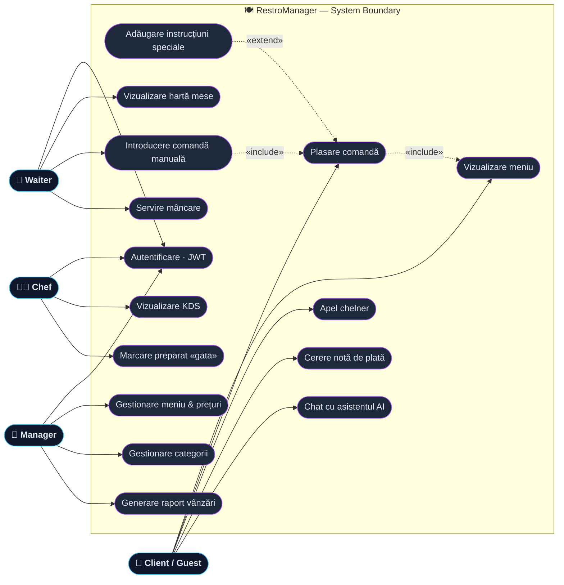
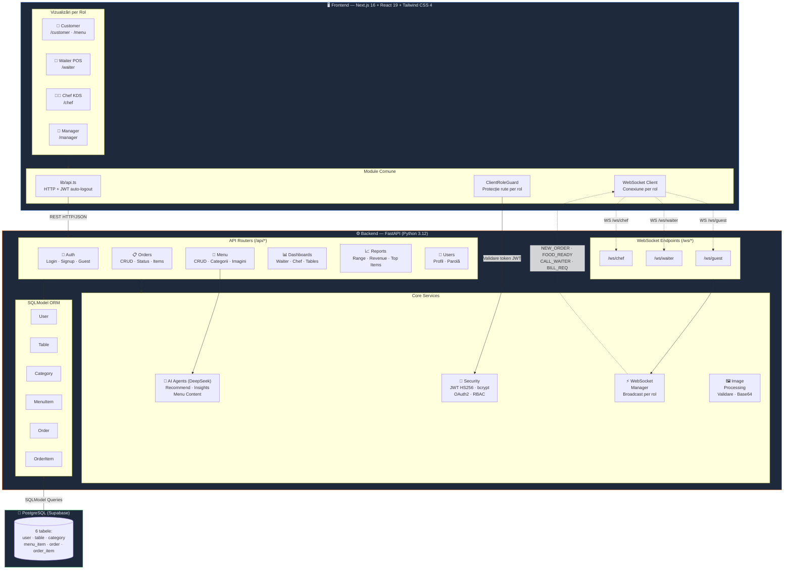
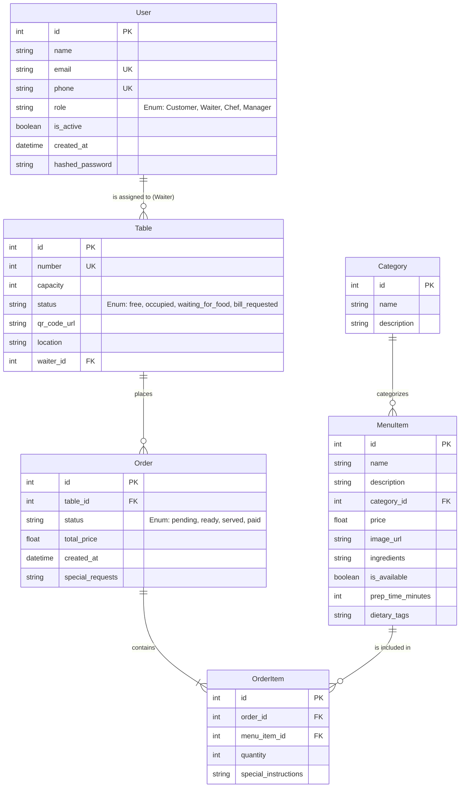
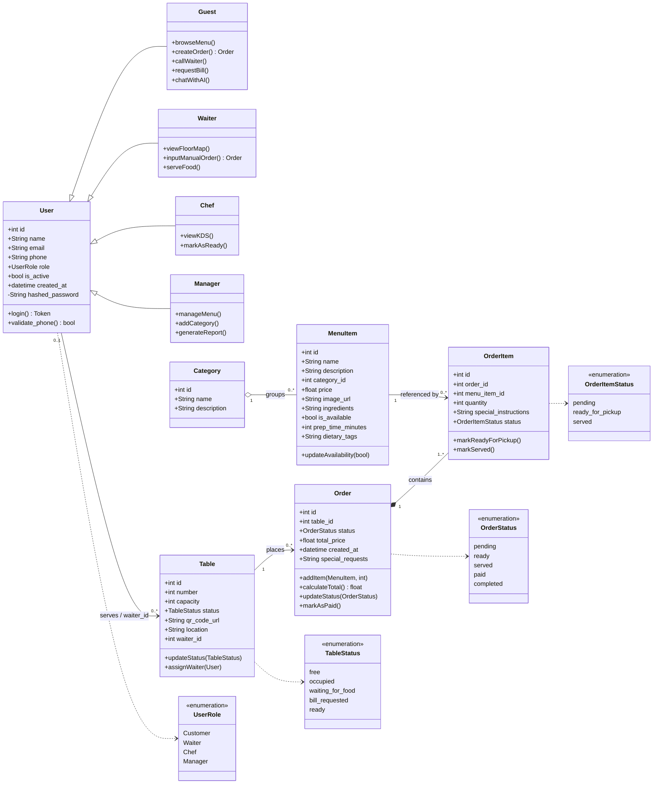
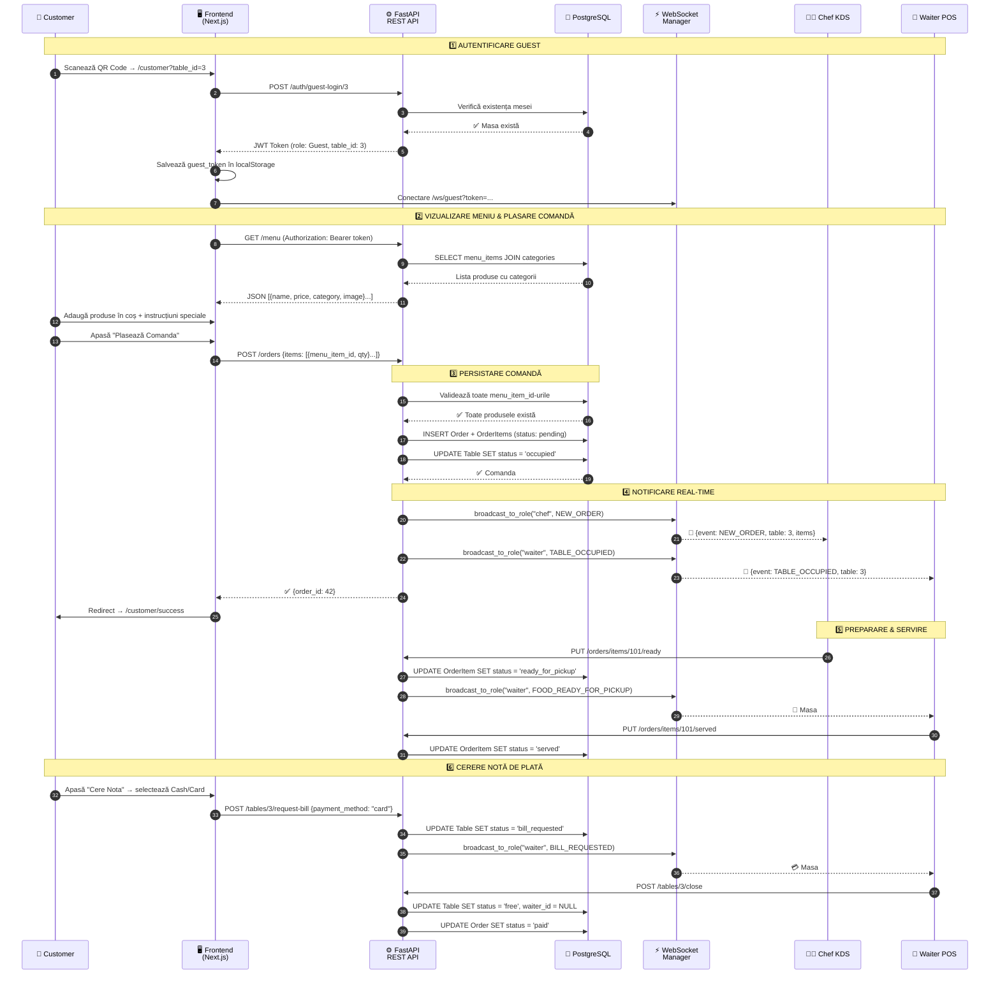
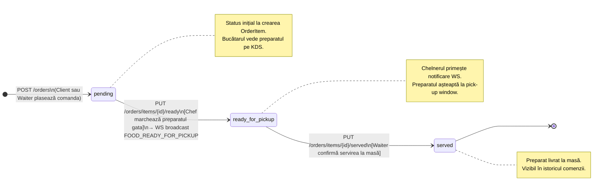

# RestroManager 🍽️
*We are "vibe coding" our way to a better dining experience.*

## 🎯 Product Vision
**RestroManager** is a full-stack university project designed to act as the ultimate digital manager for modern restaurants. Our primary goal is to **smooth out the customer experience** by removing traditional dining friction—from waiting for menus to trying to catch a waiter's attention. By connecting the Customer, Waiter, Chef, and Manager into one seamless, real-time digital flow, RestroManager ensures faster service, fewer errors, and a more enjoyable environment for everyone.

---

## 👤 User Stories

### 📱 For the Customer
* **US 1:** As a customer, I want to view the digital menu by categories (drinks, main courses, desserts) with pictures and ingredients, so that I know exactly what I'm ordering and can find items quickly.
* **US 2:** As a customer, I want to add special instructions to a dish (e.g., "no onion" or "well done"), so that my food respects my dietary preferences and allergies.
* **US 3:** As a customer, I want a "Call Waiter" button in the app, so that I can easily request assistance or order extras without having to wave across the room.
* **US 4:** As a customer, I want an AI-powered chat assistant that recommends dishes based on my preferences and dietary restrictions, so that I can discover new menu items I'll enjoy.

### 🏃 For the Waiter
* **US 5:** As a waiter, I want to see a color-coded floor map showing the real-time status of each table (free, occupied, waiting for food, bill requested), so that I know exactly where my attention is needed.
* **US 6:** As a waiter, I want to receive a push notification on my device when an order is ready in the kitchen, so that I can serve the food hot and fresh immediately.
* **US 7:** As a waiter, I want to receive a push notification on my device when one of my customers calls me, so I can be there for them ASAP and assist them.
* **US 8:** As a waiter, I want to manually input orders into the system for customers not using the app, so that all restaurant orders stay synced in one central digital flow.

### 👨‍🍳 For the Chef
* **US 9:** As a chef, I want to see a Kitchen Display System (KDS) with order tickets ordered chronologically, so that I know exactly what to prioritize and cook first.
* **US 10:** As a chef, I want to mark a dish/order as "Ready to serve" with a single tap, so that it automatically notifies the assigned waiter to pick it up.

### 👔 For the Manager
* **US 11:** As a manager, I want to easily add, edit, or remove menu items and prices, so that I can keep the restaurant's offering updated in real-time without reprinting physical menus.
* **US 12:** As a manager, I want to generate an end-of-day sales report, so that I can track total revenue and identify the best-selling menu items.
* **US 13:** As a manager, I want to add categories in my UI so that the products are filtered as I wish in the menu.
* **US 14:** As a manager, I want an AI assistant that turns my end-of-day sales report into plain-language insights I can ask follow-up questions about, so that I understand *why* the numbers moved without digging through raw figures myself.
* **US 15:** As a manager, when I add a new menu item I want an AI agent to draft its description, dietary tags, a suggested category, and a sensible price range from just the dish name and ingredients, so that I can publish polished, consistent menu entries in seconds instead of writing each one by hand.

---

## 🎭 UML Use Case Diagram

Diagrama de cazuri de utilizare mapează cei patru **actori** (Client/Guest, Waiter, Chef, Manager) la acțiunile pe care le pot executa în sistem. Relațiile `«include»` marchează un comportament obligatoriu reutilizat, iar `«extend»` un comportament opțional care extinde un caz de bază.



---

## 🛠️ Tech Stack
To ensure a highly responsive, real-time experience while maintaining a clean and scalable codebase, RestroManager is built using a modern decoupled architecture:

### Frontend
* **Framework:** Next.js 16+ (React 19+, TypeScript)

### Backend
* **Framework:** FastAPI (Python 3.12)
* **ORM:** SQLModel (SQLAlchemy + Pydantic)
* **Database:** PostgreSQL (psycopg2-binary)
* **Schema:** SQLModel `metadata.create_all()` via `seed.py` (no migration tool)
* **Authentication:** JWT (PyJWT) + bcrypt
* **Testing:** pytest with async support
* **Configuration:** pydantic-settings

### Real-time & Communication
* **WebSocket:** Native FastAPI WebSockets
* **HTTP Client:** httpx

### AI & External Services
* **AI Recommendation Agent:** DeepSeek V4 (via OpenAI-compatible API)
* **SDK:** openai (Python)
* **API Base:** https://api.deepseek.com

---

## 📐 Arhitectura Sistemului (Component Diagram)

RestroManager folosește o **arhitectură decuplată pe 3 straturi**: un frontend Next.js cu vizualizări per rol, un backend FastAPI modular (routere REST + WebSocket real-time), și o bază de date PostgreSQL accesată prin SQLModel ORM. Cererile standard (meniu, comenzi, rapoarte) folosesc **REST API**, iar evenimentele sensibile la timp (notificări bucătărie, apel chelner, status masă) trec prin **WebSocket** pentru actualizări instantanee. Securitatea este asigurată prin **JWT Role-Based Auth** (Guest, Waiter, Chef, Manager). Trei **agenți AI** DeepSeek (API compatibil OpenAI) asistă utilizatorii: un agent de **recomandare** oferă sugestii personalizate clienților printr-un chat, un agent de **insights** transformă raportul de vânzări al managerului în concluzii pe înțeles, iar un agent de **conținut meniu** redactează descrieri pentru produsele noi.



**Cum funcționează fluxul:** Fiecare rol (Customer, Waiter, Chef, Manager) accesează o vizualizare dedicată în frontend-ul Next.js. Toate cererile HTTP trec prin modulul centralizat `lib/api.ts` care injectează automat token-ul JWT și gestionează expirarea sesiunii. Routerele FastAPI procesează logica de business, validează permisiunile prin middleware-ul RBAC, și accesează baza de date prin modelele SQLModel.

**Comunicarea real-time:** La plasarea unei comenzi, WebSocket Manager-ul broadcast-ează evenimentul `NEW_ORDER` către Chef KDS. Când bucătarul marchează un preparat ca „Gata", evenimentul `FOOD_READY_FOR_PICKUP` ajunge instant la chelnerul asignat. Clientul poate de asemenea trimite `CALL_WAITER` sau `BILL_REQUESTED` prin canalul WebSocket dedicat.

## 🗄️ Database Schema

The foundational data model ensures a normalized and robust representation of the restaurant's operational flow.



---

## 🧩 UML Class Diagram (Domain Model)

Diagrama de clase reflectă modelele SQLModel din `backend/models/`. Pe lângă atributele tipizate, sunt incluse metode de domeniu relevante și **specializările de rol** ale lui `User` (implementate în cod printr-un enum `UserRole` + RBAC, reprezentate aici ca moșteniri pentru a evidenția comportamentul specific fiecărui rol). Relațiile marchează **compoziția** (`Order *-- OrderItem`: un item nu poate exista fără comanda sa), **agregarea** (`Category o-- MenuItem`) și **asocierile** cu multiplicități.



---

## � Fluxul unei Comenzi (Sequence Diagram)

Diagrama de mai jos ilustrează ciclul complet al unei comenzi — de la scanarea codului QR de către client, până la servirea mâncării și cererea notei de plată. Aceasta arată interacțiunea dintre toate cele 4 roluri și sistemele intermediare (API, AI, WebSocket, Baza de Date).



**Pașii 1–2 (Autentificare & Meniu):** Clientul scanează codul QR de pe masă, care deschide aplicația cu parametrul `table_id`. Frontend-ul obține automat un JWT token de tip Guest (fără cont/parolă), apoi afișează meniul grupat pe categorii. La plasarea comenzii, frontend-ul trimite `menu_item_id` (nu numele) pentru fiecare produs, iar backend-ul calculează totalul server-side din prețurile reale din DB.

**Pașii 3–4 (Persistare & Notificări):** Backend-ul validează `menu_item_id`-urile, recalculează totalul server-side din prețurile reale, persistă comanda și marchează masa ocupată. Comanda este apoi broadcast-ată în timp real prin WebSocket către Chef KDS și către Waiter POS (notificare de masă ocupată).

**Pașii 5–6 (Servire & Plată):** Bucătarul marchează fiecare preparat individual ca „Gata", iar chelnerul primește notificarea instant și confirmă servirea. La final, clientul poate cere nota direct din aplicație, iar chelnerul închide masa — resetând statusul la „free" pentru următorii clienți.

---

## � Ciclul de Viață al Comenzii (State Diagram)

Diagramele de mai jos ilustrează toate stările posibile pentru entitățile centrale ale sistemului: `OrderItem` (un preparat individual) și `Order` (întreaga comandă a mesei). Tranzițiile sunt declanșate fie de acțiunile utilizatorilor (Chef, Waiter), fie automat de backend la evenimentele de sistem.

### OrderItem — Stările unui Preparat Individual



### Order — Stările Comenzii de Masă


**`OrderItem`** urmează un flux liniar strict: `pending → ready_for_pickup → served`. Fiecare tranziție este declanșată de un rol specific — bucătarul marchează `ready_for_pickup` (cu notificare WS instantanee), iar chelnerul confirmă `served` după livrare. Stările sunt independente per preparat, permițând servirea parțială a comenzii.

**`Order`** are un ciclu de viață mai complex: rămâne în `pending` atât timp cât bucătăria lucrează, poate primi produse adiționale în această stare (de la Waiter sau un al doilea client la aceeași masă), și trece prin `ready → served → paid` odată ce toată masa a fost servită și nota achitată.

---

## �🚀 Quick Start (Local Development)

To make it as easy as possible to grade or review the system, the backend is fully containerized.

### Prerequisites
- **Docker & Docker Compose** (Colima, Docker Desktop, etc.)
- **Python 3.12+** (For the local virtual environment)
- A **PostgreSQL** database (We use a cloud Supabase instance, but any standard PostgreSQL works)

### 1. Configure the Environment

1. Clone the repository.
2. Create a `.env` file in the root directory containing your DB URL:
```env
DATABASE_URL="postgresql://[USER]:[PASSWORD]@[HOST]:5432/postgres"
```

### 2. Run the API (Backend with Docker)

We use Docker for a seamless hot-reloading experience. From the root directory:
```bash
docker compose up --build
```
> The Interactive API Documentation (Swagger) will instantly be available at `http://localhost:8000/docs`.

### 3. Seed the Database

To populate the fresh database with a Manager, 5 Tables, Categories, and 10 Menu Items, open a new terminal:
```bash


# 1. Create & activate a virtual environment

python3 -m venv .venv
source .venv/bin/activate

# 2. Install backend utilities

pip install -r backend/requirements.txt

# 3. Populate database
python backend/seed.py
```

## 🤖 AI Recommendation Agent

RestroManager includes an AI-powered chat assistant to help customers discover dishes they'll love.

### Configuration

Add your DeepSeek API key to `.env`:

```env
DEEPSEEK_API_KEY=your_deepseek_api_key_here
```

Get your API key at: https://platform.deepseek.com/

### Features

| Feature | Description |
|---------|-------------|
| 💬 Chat Interface | Natural conversation to understand customer preferences |
| 🍽️ Smart Recommendations | Suggests 2-3 dishes based on taste, allergies, dietary restrictions |
| 🛡️ Safety Guard | Only answers food/menu questions; redirects off-topic queries |
| 📝 Special Notes | Dialog for adding instructions when adding AI-recommended items |
| 🔄 Fallback | Keyword matching when AI service is unavailable |

### Available Models

- `deepseek-v4-flash` (default) - Fast responses, cost-effective
- `deepseek-v4-pro` - Higher quality, better JSON formatting

---

## 🔒 Security

Security is enforced server-side at every layer — the frontend is never trusted as a gatekeeper. The model is **stateless JWT + role-based access control (RBAC)**.

### Authentication & Authorization

| Mechanism | Implementation |
|-----------|----------------|
| **Token format** | JWT signed with **HS256** (`PyJWT`), 30-minute expiry (`ACCESS_TOKEN_EXPIRE_MINUTES`) |
| **Login** | `POST /api/auth/login` issues a token carrying `sub` (email), `role`, and `user_id` |
| **Guest access** | `POST /api/auth/guest-login/{table}` issues a short-lived **Guest** token with the `table_id` baked in — the table number is read from the *token*, never from the request body, so a guest cannot act on another table |
| **RBAC** | `require_role([...])` dependency (`backend/core/security.py`) checks `current_user.role` on every protected route; mismatched role → **403**, missing/invalid token → **401** |
| **Privilege escalation guard** | Public `register` always assigns the `Customer` role server-side — staff accounts (Waiter/Chef/Manager) can only be provisioned by an admin/seed, never via self-signup |
| **WebSocket auth** | `/ws/{role}` validates the JWT from the query string and rejects the connection (close code `4001`) if the token's role doesn't match the requested channel |

### Password & Secret Management

- **Password hashing:** `bcrypt` with a per-password salt (`bcrypt.gensalt()`); plaintext passwords are never stored or logged. Minimum length 8 (enforced by the `UserCreate` schema).
- **`SECRET_KEY` validation:** the app **refuses to boot** if `SECRET_KEY` is missing, under 32 characters, or a known placeholder (`backend/core/config.py`).
- **No secrets in source:** only `.env_example` (placeholders) is committed; the real `.env` is git-ignored. Seed staff passwords are read from `SEED_MANAGER_PASSWORD` / `SEED_WAITER_PASSWORD` / `SEED_CHEF_PASSWORD` — `seed.py` aborts if they're unset.

### Input Validation & Abuse Prevention

| Surface | Protection |
|---------|-----------|
| **SQL injection** | All DB access goes through SQLModel/SQLAlchemy parametrized queries — no string-built SQL |
| **Order totals** | Recomputed **server-side** from real menu prices; client-sent totals are never trusted |
| **Image uploads** | Manager-only, `Content-Type` allowlist **plus magic-byte signature check** (defeats Content-Type spoofing), 10 MB size cap, re-encoded to WebP (`backend/api/menu.py`) |
| **Brute-force** | `slowapi` rate limits on auth: **login 5/min, register 3/min, guest-login 10/min** (keyed by client IP → `429` on excess) |
| **CORS** | Locked to the known frontend origins (`localhost:3000` + the Netlify production URL); credentials allowed only for those |

### Known limitations & hardening notes

- **JWT is stored in `localStorage`** on the client (convenient, but readable by any XSS). The app ships no XSS sinks (no `dangerouslySetInnerHTML`/`innerHTML`), which keeps the practical risk low; a production deployment would prefer `httpOnly` cookies + CSRF protection.
- **Rate limiting is keyed by `request.client.host`.** Behind a reverse proxy, run uvicorn with `--proxy-headers --forwarded-allow-ips="*"` so the real client IP is used instead of the proxy's.
- **No refresh tokens / token revocation list** — a leaked token is valid until it expires (30 min). Acceptable for this project's scope.

---

## 📡 API Reference

All REST routes are mounted under **`/api`**; interactive docs (Swagger UI) are auto-generated at **`http://localhost:8000/docs`**. The **Access** column lists who may call each route:

- **Public** — no token required.
- **Guest** — a table guest token (from `guest-login`).
- **Any auth** — any logged-in user (Customer/Waiter/Chef/Manager).
- **Role names** — exactly those roles (everyone else gets `403`).

### Authentication — `/api/auth` *(rate-limited)*

| Method | Path | Access | Description |
|--------|------|--------|-------------|
| `POST` | `/api/auth/register` | Public | Register a new **Customer** account (3/min → 429) |
| `POST` | `/api/auth/login` | Public | Authenticate, returns a JWT (5/min) |
| `POST` | `/api/auth/guest-login/{table_number}` | Public | Issue a Guest token after a QR scan; validates the table exists (10/min) |

### Users — `/api/users`

| Method | Path | Access | Description |
|--------|------|--------|-------------|
| `GET` | `/api/users/me` | Any auth | Current user's profile |
| `PUT` | `/api/users/me` | Any auth | Update own profile |

### Menu & Categories — `/api/menu`, `/api/categories`

| Method | Path | Access | Description |
|--------|------|--------|-------------|
| `GET` | `/api/menu` | Public | List menu items (with categories) |
| `GET` | `/api/menu/{item_id}` | Public | Single menu item |
| `POST` | `/api/menu` | Manager | Create a menu item |
| `POST` | `/api/menu/ai-generate` | Manager | AI-assisted menu content draft |
| `POST` | `/api/menu/upload-image` | Manager | Validate + optimize a dish image |
| `PUT` | `/api/menu/{item_id}` | Manager | Update a menu item |
| `DELETE` | `/api/menu/{item_id}` | Manager | Delete a menu item |
| `GET` | `/api/categories` | Public | List categories |
| `POST` | `/api/categories` | Manager | Create a category |
| `PUT` | `/api/categories/{category_id}` | Manager | Update a category |
| `DELETE` | `/api/categories/{category_id}` | Manager | Delete a category |

### Orders — `/api/orders`

| Method | Path | Access | Description |
|--------|------|--------|-------------|
| `POST` | `/api/orders` | Guest or any auth | Place an order (totals computed server-side) |
| `PATCH` | `/api/orders/{order_id}/status` | Chef, Manager | Update order status |
| `PUT` | `/api/orders/items/{item_id}/ready` | Chef, Manager | Mark a single item ready for pickup |
| `PUT` | `/api/orders/{order_id}/ready-for-pickup` | Chef, Manager | Mark the whole order ready |
| `PUT` | `/api/orders/items/{item_id}/served` | Waiter, Manager | Mark an item served |
| `POST` | `/api/orders/{order_id}/checkout` | Waiter, Manager | Close the order and free the table |

### Dashboards (RBAC) — `/api`

| Method | Path | Access | Description |
|--------|------|--------|-------------|
| `GET` | `/api/waiter/tables` | Waiter, Manager | Floor map: all tables + status |
| `PATCH` | `/api/waiter/tables/{table_id}/status` | Waiter, Manager | Change a table's status |
| `GET` | `/api/waiter/tables/{table_id}/active-order` | Waiter, Manager | Active order for a table |
| `PUT` | `/api/waiter/tables/{table_id}/claim` | Waiter | Claim a table |
| `POST` | `/api/waiter/tables/{table_id}/orders` | Waiter | Waiter-entered order |
| `POST` | `/api/tables/{table_number}/request-bill` | Guest | Request the bill |
| `POST` | `/api/tables/{table_id}/close` | Waiter, Manager | Close a table after payment |
| `GET` | `/api/chef/active-orders` | Chef, Manager | KDS queue of pending orders |
| `GET` | `/api/manager/stats` | Manager | Aggregated dashboard stats |

### Reports & AI — `/api/reports`, `/api/recommendations`, `/api/insights`

| Method | Path | Access | Description |
|--------|------|--------|-------------|
| `GET` | `/api/reports/range` | Manager | Sales report for a date range |
| `POST` | `/api/recommendations/chat` | Guest or any auth | Customer AI dish-recommendation chat |
| `POST` | `/api/recommendations/chat/clear` | Guest or any auth | Reset the recommendation session |
| `POST` | `/api/insights/chat` | Manager | Manager AI business-insights chat |
| `POST` | `/api/insights/chat/clear` | Manager | Reset the insights session |

### WebSocket — `/ws`

| Endpoint | Access | Description |
|----------|--------|-------------|
| `WS /ws/{role}` | JWT in `?token=` (role must match channel) | Real-time channel per role; relays `NEW_ORDER`, `FOOD_READY`, `CALL_WAITER`, `BILL_REQUESTED` |

---

## 🧪 AI Agent Evaluation Framework

RestroManager includes a comprehensive evaluation framework for the DeepSeek-powered agents, covering all three LLM agents: the **customer recommendation** agent, the **manager insights** agent, and the **menu content generator**. It spans recommendation quality, safety guardrails, conversational coherence, grounding/faithfulness, and output-contract validation.

📖 Full details, metrics, and how-to: [`backend/tests/evals/README.md`](backend/tests/evals/README.md)

### What's Included

| Component | Description | Test Count |
|-----------|-------------|------------|
| **Recommendation Quality** | Precision@K, NDCG, diversity metrics (customer agent) | 15+ tests |
| **Safety Guardrails** | Off-topic rejection, false positive rate | 20+ tests |
| **Conversational Quality** | Context retention, session persistence | 15+ tests |
| **Manager Insights** | Grounding (no invented figures), price-suggestion correctness, robustness | 3 real + 9 regression |
| **Menu Content Generator** | Output structure, server-side `is_new` recompute, field clamping | 2 real + 8 regression |
| **Metrics** | Scoring functions: Precision, Recall, NDCG, Diversity, **Grounding** | 13 functions |
| **Test Data** | Mock menu, mock sales report, 20 golden queries, 30 adversarial inputs | - |

### Two levels: real evals vs. regression tests

An *eval* measures the **live model's** output quality, so it calls the API and costs tokens — that's the point. To keep everyday test runs and CI free, the manager-agent evals are **opt-in**:

| Level | Location | Calls model? | Cost | Runs by default |
|-------|----------|--------------|------|-----------------|
| **Real eval** (quality) | `backend/tests/evals/test_*_quality.py` | ✅ live | tokens | ❌ skipped unless `RUN_AI_EVALS=1` |
| **Regression test** (plumbing) | `backend/tests/unit/core/test_*_agent.py` | ❌ mocked | free | ✅ with the unit suite |

The regression tests pin the deterministic scaffolding (prompt assembly, JSON-parse resilience, multi-turn history, server-side validation, fallback); the real evals score the model itself (grounding, price reasoning, generated-content structure).

### Running the evals

```bash
cd backend

# Free, deterministic — runs on every CI build:
pytest tests/unit tests/integration

# Real evals — opt-in, consume API tokens (needs DEEPSEEK_API_KEY):
RUN_AI_EVALS=1 pytest tests/evals/test_insights_quality.py -v -s
RUN_AI_EVALS=1 pytest tests/evals/test_menu_content_quality.py -v -s
RUN_AI_EVALS=1 pytest tests/evals          # full eval suite
```

### Key metric: grounding (faithfulness)

The manager insights agent must answer **only** from the sales report and menu prices it is given — it must never invent figures. The `grounding` metric (`backend/tests/evals/metrics/grounding.py`) extracts every number from a response and checks each is backed by the data (report figures, quantities, daily revenue, period dates), ignoring derived percentages. A faithful summary scores **1.0**.

### Latest results (2026-06-08, `deepseek-v4-flash`)

| Suite | Result |
|-------|--------|
| Backend unit + integration | **111 passed** (no API) |
| Frontend (vitest) | **29 passed** |
| Manager-agent real evals (`RUN_AI_EVALS=1`) | **5 passed** — insights grounding **1.00**, happy-hour price derived from real menu price, menu generator structure valid |
| Full real eval suite | **45 passed, 2 failed** — both pre-existing customer-agent eval issues (flaky mock JSON + live-model non-determinism), unrelated to the manager agents; documented in the [eval README](backend/tests/evals/README.md) |

> Reproduce: `pytest tests/unit tests/integration` (free) and `RUN_AI_EVALS=1 pytest tests/evals` (tokens). Real-eval numbers vary slightly run-to-run since they exercise the live model.

